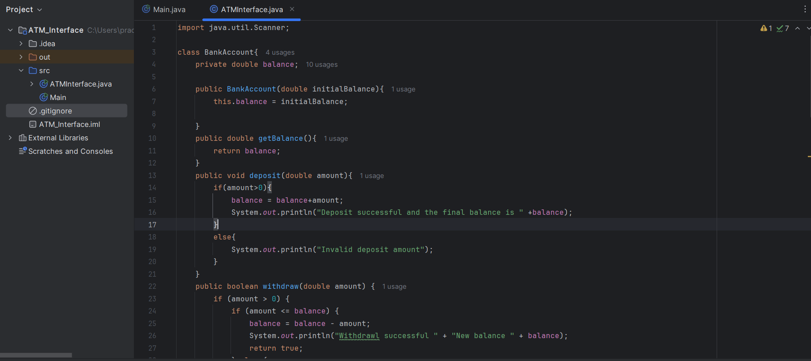
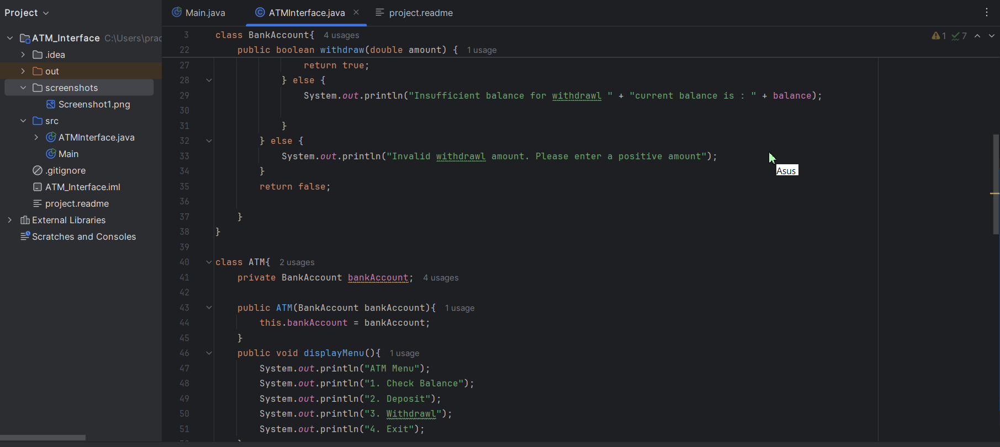
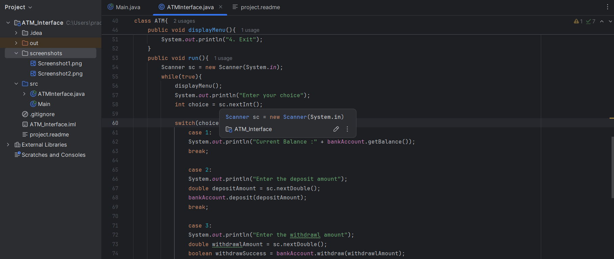
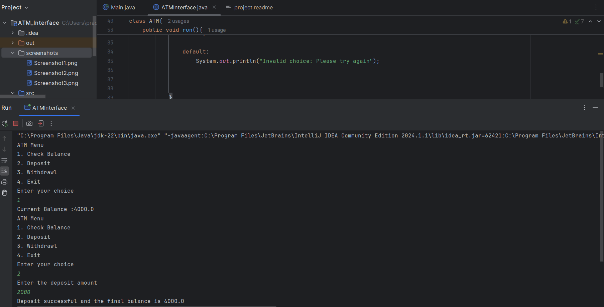

# ATM Interface Project

This project simulates an ATM interface using Java. It allows users to create a bank account, check their balance, deposit money, and withdraw funds. The program ensures that deposits are positive values and verifies that withdrawals do not exceed the available balance.

## Features

- **Create Account:** Initializes the bank account with an initial balance.
- **Check Balance:** Displays the current balance of the account.
- **Deposit:** Adds a specified amount to the balance, with validation for positive values.
- **Withdraw:** Deducts a specified amount from the balance if sufficient funds are available.

## Project Structure

The project consists of the following main components:

- **BankAccount Class:** This class manages the balance and provides methods for deposits, withdrawals, and balance inquiries.
- **Main Class:** The main class where the program execution starts. It allows users to interact with the ATM interface.

## Code Screenshot

Below is a screenshot of the `BankAccount` class where core ATM functionalities such as deposit and withdraw methods are implemented.









## Getting Started

To get a local copy up and running, follow these steps.

### Prerequisites

- Java Development Kit (JDK) 8 or above
- Java IDE (such as IntelliJ IDEA, Eclipse, or NetBeans)

### Installation

1. Clone the repository:
   ```bash
   git clone https://github.com/Snehapandey04/ATM-Interface.git
